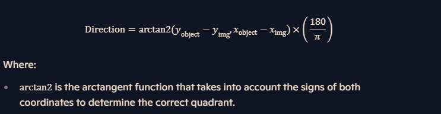

## Table of contents:
- [Cursor's speed](#about-the-cursors-speed)
- [Selecting Image](#selecting-image-based-on-speed-and-direction)


# CURSOR's SPEED AND DIRECTION DECIDE THE IMAGE:
The speed detection of the image is accomplished through a few key steps in ``script.js`` file:

## Tracking Mouse Movements:

The script listens for the mousemove event on the document.

When the mouse moves, it captures the current mouse coordinates (event.clientX and event.clientY).

## Calculating Speed:

The script calculates the distance the mouse has moved (``deltaX`` and ``deltaY``).

It also calculates the time elapsed since the last movement (``deltaTime``).

By using these values, it calculates the speed as the Euclidean distance divided by the elapsed time: 
- Speed fomula in Cursor Mode:

- Speed fomula in Object Mode:


## Determining Direction:

The direction is calculated using the ```Math.atan2``` function, which returns the angle (in radians) between the positive ``x-axis`` and the line to the point (``deltaX``, ``deltaY``). The angle is then converted to degrees:

- Direction fomula in Cursor Mode:

- Direction fomula in Object Mode:


# SELECTING IMAGE BASED ON SPEED AND DIRECTION:

The ``getImageBasedOnSpeedAndDirection`` function determines which FORM of image to display based on the calculated speed and direction.

The speed is mapped to a speed factor, which determines the distance the image moves within the grid.


The direction is used to determine the `x` and `y` offsets within the grid, as you can see, i mapped the image above in to array:
````
11  12  13  14  15
21  22  23  24  25
31  32  33  34  35
41  42  43  44  45
51  52  53  54  55
The image 33 is center.
````
The grid boundaries are clamped to ensure the selected image stays within the defined range ``(1 to 5)``.

## Updating Image and Position:

If the direction change is within a certain threshold, the image position is updated without changing the image source.

Otherwise, the image source is updated based on the new speed and direction, and the position is adjusted accordingly.

## directionThreshold
The ``directionThreshold`` variable is set to a value (e.g., 10) to define a minimum threshold for direction changes. It helps to avoid unnecessary updates to the floating image's position and image source when the direction changes are too small or rapid. By implementing this threshold, I ensure that the image follows the cursor or object in a more controlled and smooth manner, preventing jittery movements.

Example: If directionThreshold is set to 10, direction changes less than 10 degrees will not trigger a change in the image's position or source.

### Key Points:

- Purpose: To create a smoother movement for the floating image.

- Function: Ignores small changes in direction below the threshold value.
