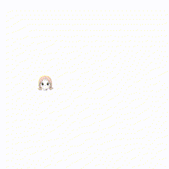

# Cursor Follower

One day, while scrolling through social media, I came across this image: 


... An idea suddenly struck me to use multiple patterns of this image to make it move, but I didn't know where to apply it. So, I created this so that I can use it later when needed."

This project features an interactive web page where an image follows the cursor or a draggable object.

"To clarify, I AM NOT a WIBU."

## Features

- **Follow the Cursor Mode**: The floating image (`33.jpeg`) follows the cursor movement on the screen.
- **Fullscreen Mode**: A button to toggle fullscreen mode for an immersive experience.

## File Structure

- **index.html**: The main HTML file.
- **styles.css**: CSS for styling the page.
- **script.js**: JavaScript for functionality.
- **img/**: Folder containing images (`33.jpeg`, `Object.jpeg`, and `fullscreen.ico`).

## Usage

1. **Follow the Cursor Mode**:
    - This is the default mode where the floating image follows the cursor movement.

## How to Run

1. **Clone the Repository**:
    ```sh
    git clone https://github.com/nguyenanvi/CursorFollower.git
    cd CursorFollower
    ```

2. **Open the Project**:
    - Open `index.html` in your web browser.

3. **Toggle Fullscreen**:
    - Click the button with the fullscreen icon to toggle fullscreen mode.

## Screenshots

### Follow the Cursor Mode


