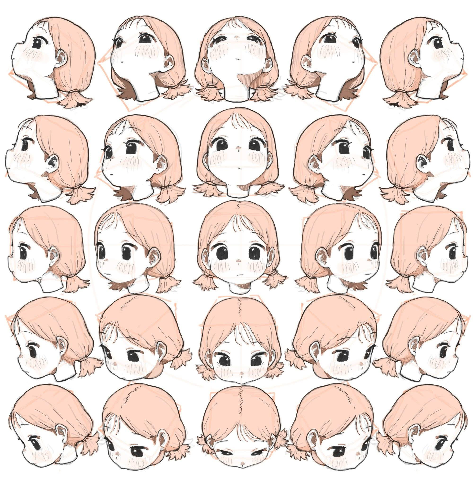

# Cursor Follower

One day, while scrolling through social media, I came across this image: 



... An idea suddenly struck me to use multiple patterns of this image to make it move, but I didn't know where to apply it. So, I created this so that I can use it later when needed."

This project features an interactive web page where an image follows the cursor or a draggable object.

"To clarify, I AM NOT a WIBU."

## Features

- **Cursor Mode**: The floating image (`33.jpeg`) follows the cursor movement on the screen.
- **Object Mode**: The floating image (`33.jpeg`) follows the Object (`Draggable.webp`) on the screen.
- **Fullscreen Mode**: A button to toggle fullscreen mode for an immersive experience.
- **Zooming Mode**: Can zoom the floating image by scroll key and 2-fingers gesturing.
- **Offline features**: Load 1 time, run anywhere (This feature is in development)

## File Structure
```
/
|_ index.html: The main HTML file.
|_ styles.css: CSS for styling the page.
|_ script.js: JavaScript for functionality.
|_ sw.js: Register Sevice Worker to work in Offline.
|_ img/: Folder containing images.
```
## Usage

1. **Follow the Cursor Mode**:
    - This is the default mode where the floating image follows the cursor movement.

    

2. **Follow the Object Mode**:
    - Click the button on top-left corner.

    

3. **Zooming**:
    - Using scroll mouse, pinch or stretch out two fingers.

## How to Run

1. **Clone the Repository**:
    ```sh
    git clone https://github.com/nguyenanvi/CursorFollower.git
    cd CursorFollower
    ```

2. **Open the Project**:
    - Open `index.html` in your web browser.

3. **Toggle Fullscreen**:
    - Click the button with the fullscreen icon to toggle fullscreen mode.


